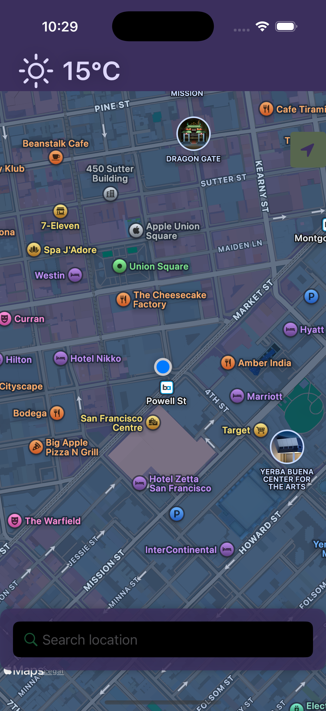
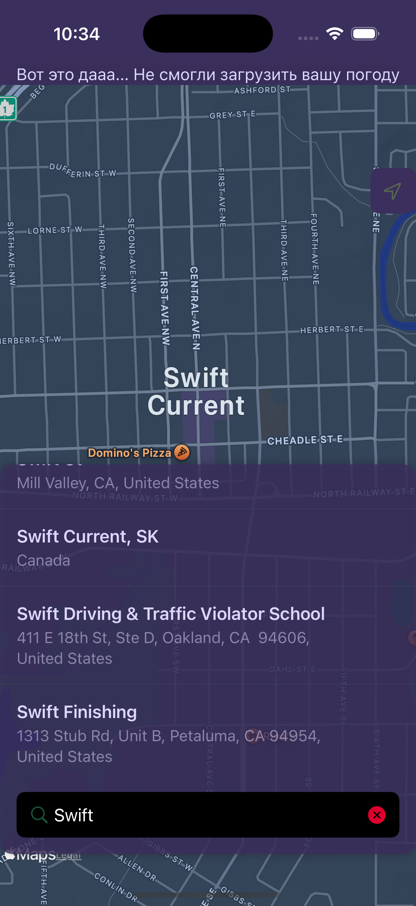

# WeatherWise — iOS Weather Application

WeatherWise — это элегантное и мощное приложение для прогнозирования погоды, созданное с использованием SwiftUI, Combine, и Realm. Оно предоставляет пользователю точные и обновляемые данные о погоде в реальном времени, а также прогнозы на несколько дней вперёд, отображаемые в приятном и интуитивно понятном интерфейсе.

## 📸 **Скриншоты**

Вот несколько скриншотов приложения, которые демонстрируют его функциональность:

    
    
    

## 🚀 Особенности проекта

    Прогноз погоды в реальном времени: Получение данных о текущей погоде и её подробностях, таких как температура, влажность, скорость ветра, UV-индекс и другие.

    Прогноз на несколько дней вперёд: Ежедневные и почасовые прогнозы с деталями о температуре, осадках, облачности и других погодных условиях.

    Интуитивно понятный интерфейс: Чистый, минималистичный и современный дизайн с использованием SwiftUI.

    Геолокация и карта: Автоматическое определение текущего местоположения с возможностью просмотра погодных условий в выбранной области.

    Кэширование данных: Поддержка работы с кэшированием, чтобы ускорить доступ к последним данным о погоде без необходимости каждый раз делать запросы к API.

## 🔧 Технологии

    SwiftUI: Для создания пользовательского интерфейса с использованием декларативного подхода.

    Combine: Для реактивного программирования и обработки асинхронных данных.

    Realm: Для локального хранения данных о погоде и геолокации.

    CoreLocation: Для определения местоположения пользователя и работы с географическими данными.

    Charts: Для визуализации температурных данных в виде графиков.

## 💡 Как работает приложение

    Запуск приложения: При запуске приложение получает текущие погодные данные, используя геолокацию пользователя.

    Обновление данных: Вся информация о погоде загружается через API, с учётом текущего местоположения.

    Визуализация данных: Пользователь может переключаться между компактным и расширенным режимами просмотра погоды, а также просматривать графики температуры и другие данные.

    Кэширование: Приложение кэширует данные о погоде и местоположении для быстрого доступа, что позволяет работать даже без активного интернет-соединения.

## 📱 Установка

Чтобы запустить проект на своем устройстве:

    Клонируйте репозиторий:

    git clone https://github.com/yourusername/WeatherWise.git

    Откройте проект в Xcode.

    Убедитесь, что ваш API Key для сервиса погоды (например, WeatherXu API) указан в файле Secret.swift.

    Постройте и запустите приложение на симуляторе или физическом устройстве.

## 👨‍💻 Как я это сделал

Этот проект был написан с использованием лучших современных практик разработки для iOS:

    Я использовал SwiftUI для декларативного UI, чтобы обеспечить максимально чистый и легкий код.

    Для управления асинхронными процессами и данных использовался Combine, что позволило держать UI синхронизированным с сервером.

    Для хранения данных я выбрал Realm, так как он предоставляет быструю и надёжную работу с локальными базами данных.

    Обработку геолокации и управления картой я реализовал с помощью CoreLocation и MapKit.

    Логика получения данных о погоде строится вокруг API с возможностью кэширования для повышения производительности.

## 📝 Планы на будущее

    Добавить возможность поиска по городу.

    Поддержка нескольких языков и улучшения в локализации.

    Оптимизация архитектуры с использованием подходов MVVM и более гибкой обработки ошибок.

    Расширение функционала с интеграцией push-уведомлений для предупреждений о погодных изменениях.

    Поддержка виджетов и интеграция с Siri Shortcuts.

## 📩 Контакты

Если у вас возникли вопросы или предложения, не стесняйтесь связаться со мной:

    tg: @wachrusz

